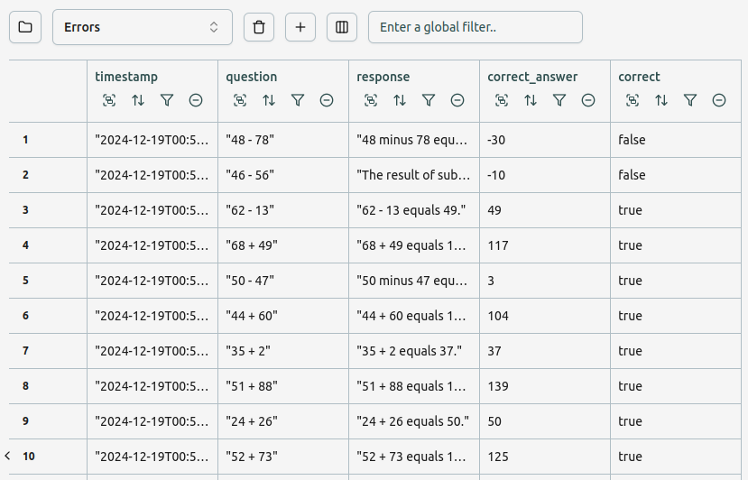
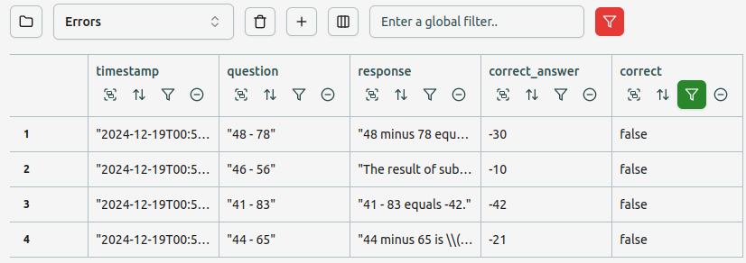
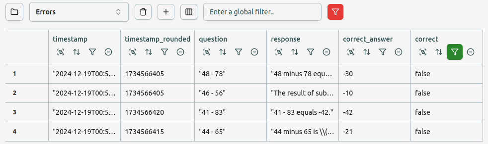

Let's assume you have an LLM application deployed, which sometimes fails in production.
You want to keep track of these failures, apply fixes, and verify that the error
rate goes down over time as a result of these improvements.

For the sake of illustration, we will use the same toy example which we use
for many of the examples in the docs; an assistant which answers simple arithmetic
questions:

```python
import unify
import datetime
from random import randint, choice

client = unify.Unify("gpt-4o@openai")

def simulate_usr_question():
    return f"{randint(0, 100)} {choice(['+', '-'])} {randint(0, 100)}"
```

We add a simple function to evaluate whether the LLM response was correct:

```python
def evaluate_response(question: str, response: str) -> float:
    correct_answer = eval(question)
    try:
        response_int = int(
            "".join([c for c in response.split(" ")[-1] if c.isdigit()]),
        )
        return correct_answer == response_int
    except ValueError:
        return False
```

Rather than tracing the entire function, in this case we explicitly log the
question, response, correct answer and whether the LLM response was correct.
Let's simulate some production usage, with the error logging included.

```python
def simulate_traffic(evaluator):
    for _ in range(50):
        question = simulate_usr_question()
        response = client.generate(question)
        correct = evaluator(question, response)
        unify.log(
            timestamp=datetime.datetime.utcnow().isoformat(),
            question = question,
            response = response,
            correct_answer = eval(question),
            correct = correct
        )

unify.activate("Errors")
simulate_traffic(evaluate_response)
```

Let's then open up the Errors interface, and add a table. We can see all of the logs
coming through by default:



Let's filter to only include logs which are *incorrect*:



Let's also turn on streaming so the table updates dynamically, as new errors come in:

IMAGE

Finally, let's add a graph to show how the error rate is changing over time.
We first need to bucket our timestamps.
Let's bucket to the nearest 10 seconds, with a new derived column `timestamp_rounded` 
using the equation `round({timestamp}, 10)`.



Let's then create a plot, and select `timestamp` as the `x` axis and `count` for the `y`
axis. Given that we have filtered for only *incorrect* logs in the table, the graph 
will only show the **error rate** across time.

IMAGE

Let's now take a look at some of the logs. It seems like we're not handling negative 
numbers correctly in the `evaluate_response` function.
Let's update this like so:

```python
def evaluate_response(question: str, response: str) -> float:
    correct_answer = eval(question)
    try:
        response_int = int(
            "".join([c for c in response.split(" ")[-1] if (c.isdigit() or c == "-")]),
        )
        return correct_answer == response_int
    except ValueError:
        return False
```

Let's simulate some more production traffic, with the update:

```python
simulate_traffic(evaluate_response)
```

Looking at our error rate graph, we can see that the error rate has dropped, but we're 
still getting some errors coming through.
Looking at the most recent errors, it seems as though subtraction is sometimes 
mistaken for a range of numbers, and the agent doesn't know that it is meant to be 
answering maths questions.

IMAGE

Let's add a simple system message:

```python
client.set_system_message("You are a helpful maths assistant, adept at answering arithmetic questions. Please respond with the integer answer as the final part of your answer")
```

Let's simulate more user data with the latest fix:

```python
simulate_traffic(evaluate_response)
```

We can see that the error rate has now gone down to zero for the latest production
traffic.
