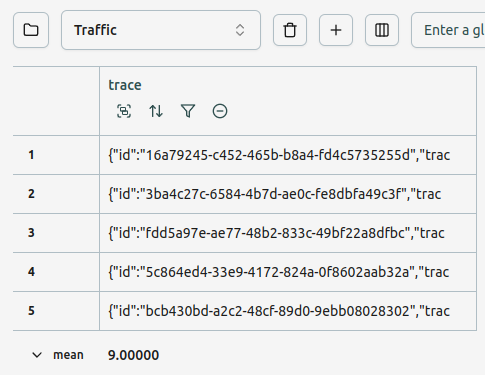
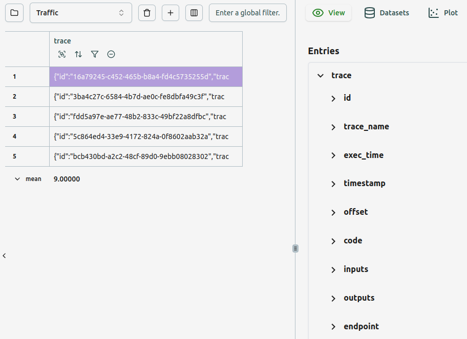
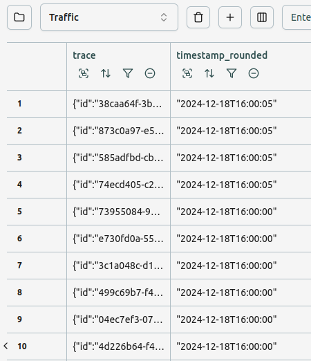
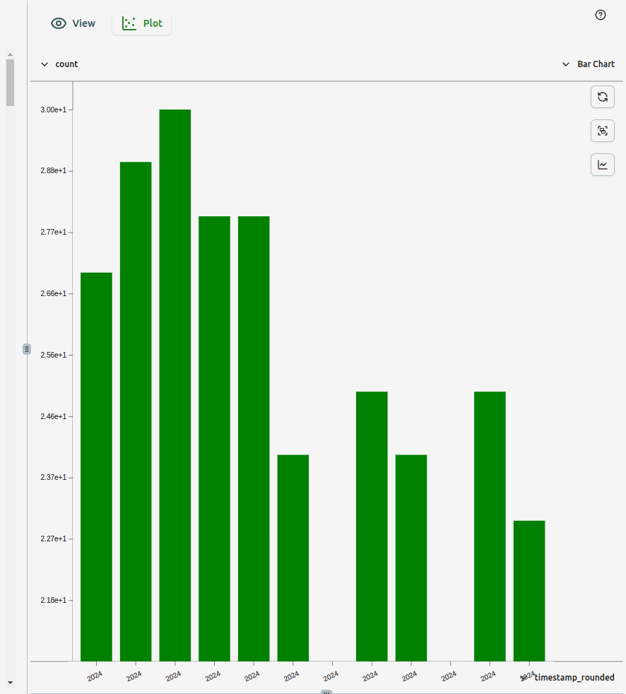

Let's assume you have an LLM application deployed, where different users are using
different models for different tasks.
You'd like to know how your traffic is changing over time, and for different models
and different tasks.

We'll assume the Unify python client is being used for a handful different endpoints,
with tracing turned on.
For other clients, you would simply need to wrap the LLM call with `unify.traced` to
log all inputs and outputs, or make explicit calls to `unify.log` for each LLM query,
logging only the specific data you'd like to track.

To avoid accruing costs, let's also turn on *caching*, such that repeat queries to the
same model simply load the previous answer from the local cache.

```python
import unify
endpoints = ("gpt-4o@openai", "claude-3.5-sonnet@anthropic", "gemini-1.5-pro@vertex-ai")
clients = [unify.Unify(ep, cache=True, traced=True) for ep in endpoints]
```

Let's now simulate the usage, and keep this infinite programming running in
the background.
We're logging this data to an interface called "Traffic":

```python
import time
import random
topics = ("maths", "history", "biology")
questions = {
    "maths": "what is 1 + 1?",
    "history": "When was the Magna Carta signed?",
    "biology": "What is a cell?"
}
with unify.Project("Traffic"):
    while True:
        time.sleep(random.uniform(0, 1))
        topic = random.choice(topics)
        question = questions[topic]
        random.choice(clients).generate(question, tags=[topic])
```

Let's now open up this interface, and let's first add a table, so we can look at the
raw data:



We're storing everything inside the nested trace, and so we only have a *single
column*. Let's add a view tile and pair it with the table, so we can actually look at these traces.



We want to know how our traffic is varying across time, but we need to do some
bucketing so we can plot a representative graph.
Let's create a new column in the table, which group our timestamps to the nearest 5 
second interval, by adding `round({trace}["timestamp"], 5)` as the equation for the 
derived column, called `timestamp_rounded`.



We can then create a bar chart showing how the usage is changing across time, using
this bucketing, like so:



If we turn on streaming, then the bar chart will continue to update dynamically, as
the program continues to run in the background.

GIF

Let's filter specifically for gpt-4o in the table, and see how this changes the bar 
chart.

IMAGE

Let's filter specifically for maths queries, and see how this changes things:

IMAGE

If we want to view different graphs simultaneously, then we can clone the table and
apply different filtering to it, and create a new graph which references the new table.

IMAGE

We can also move all of the tables to a separate tab, if we want to focus on the
graphs all in one place.

IMAGE

Hopefully this has given you an idea of how you can quickly hack together a bespoke
usage dashboard in a few seconds using Unify interfaces.
In the next demo, we'll show how you can quickly build a custom dashboard to track
production errors. See you there!
